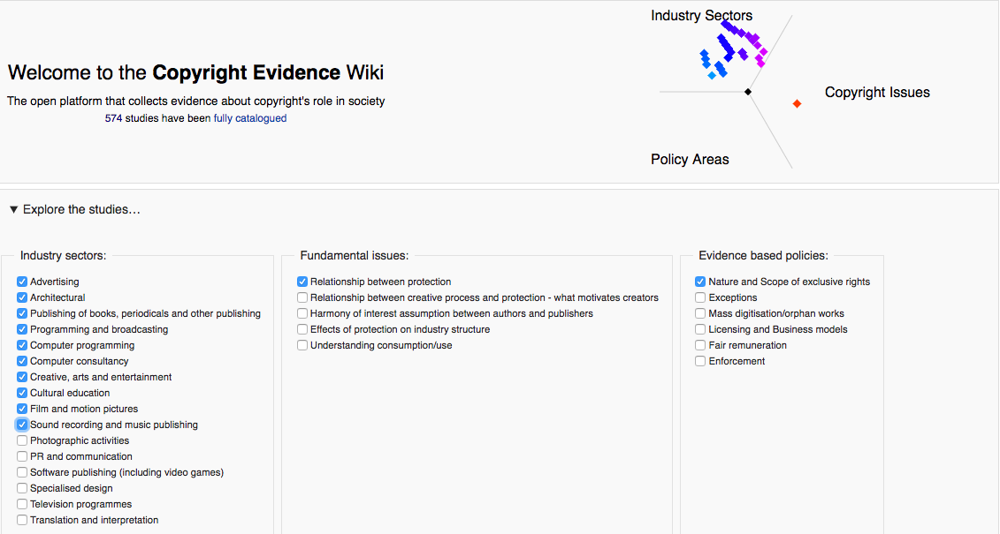

# Team Public Domain - 2016 EUHackathon entry.
Polar visualization project from team Public Domain ([@anselmbradford](https://github.com/anselmbradford) and [@contolini](https://github.com/contolini)) for the [2016 EUHackathon](http://2016.euhackathon.eu/).

## ABOUT

This project visualizes the similarities of copyright studies in the
[Copyright Evidence Wiki](http://www.copyrightevidence.org/)
across three categories: Industry Sector, Fundamental Issues, and
Evidence Based Policy Area.

Each category is mapped to a color, which then positions the study as a dot
on a color wheel. The more similar a study is to a particular study across
the three mapped categories, the closer it will appear toward the
center of the wheel. The project also includes a filter for
browsing the studies but creating a reference set of categories, which
the studies are then mapped against:

## INSTALLATIOn

 1. Clone the project with `git clone git@github.com:euhackathon/public-domain.git`.
 2. Move into the project directory with `cd public-domain`.
 3. Run a server with `python -m SimpleHTTPServer`.
 4. Visit `http://localhost:8000/demo/home/` in a web browser.
